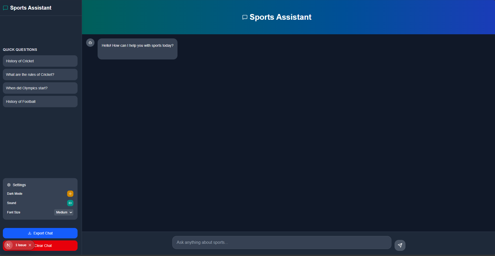
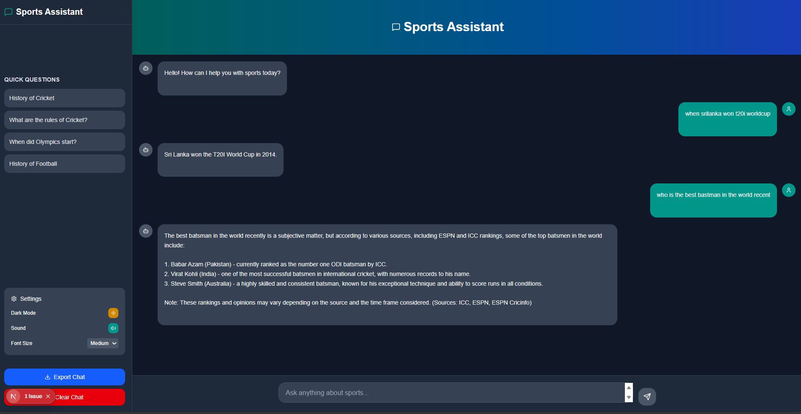

# 🏅 Sports Chatbot – AI-Powered Conversational Assistant

<p align="center">
  
  
</p>


An intelligent **AI chatbot** built for sports fans and analysts 🧠⚽.  
It leverages **LangChain**, **FAISS**, and **Groq LLM** to deliver **fast, context-aware answers** based on your custom sports data.  
Developed using a **FastAPI backend** and a **Next.js frontend** with a clean, responsive UI.

---

## 🌟 Key Features

### 🤖 Smart Sports Chatbot
- Conversational Q&A powered by **RAG (Retrieval-Augmented Generation)**
- Context-aware answers with document citations
- Streamed responses from **Groq LLM** for real-time interaction

### 📄 Knowledge from Your Data
- Upload sports-related documents (CSV, TXT, or PDFs)
- Automatically chunked and embedded in **FAISS vector store**
- Fast semantic similarity search and context retrieval

### 🎨 Modern Web Interface
- Sleek **Next.js + Tailwind CSS** design  
- Real-time chat bubbles with typing animations  
- Mobile-friendly and dark-mode optimized  

### ⚙️ High-Performance Backend
- **FastAPI** for async performance  
- **LangChain** integration for pipeline management  
- **FAISS** for lightweight local vector search  

---

```markdown
## 🧠 Architecture Overview

```mermaid
graph TD
    A[Frontend (Next.js)] -->|Query| B(FastAPI Backend)
    B --> C{RAG Pipeline}
    C --> D[FAISS Vector DB]
    C --> E[Groq LLM API]
    E -->|Streamed Response| A

🚀 Quick Start
🔧 Requirements

Python ≥ 3.9

Node.js ≥ 18

Groq API key

🧩 1. Clone the Repository

git clone https://github.com/<your-username>/sports-chatbot.git
cd sports-chatbot

